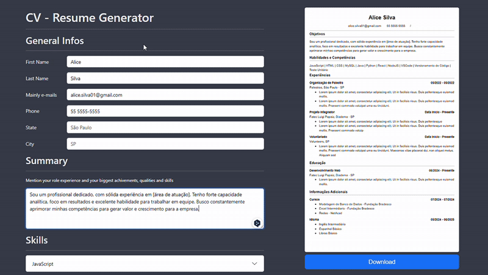

<div align="center">
  

  # React Project: CV Application - The Odin Project
  First React project from The Odin Project course, using different tools to create a fully dynamic CV generator
  <br>
  **Site**: https://react-project-cv-application.vercel.app/

</div>

## Main Information

Here you find a fully dynamic CV generator built with React, allowing users to:
- ✅ Input personal, educational, and professional details
- ✅ Preview a formatted CV in real-time
- ✅ Download/print your PDF resume

### Tools:


## Goal

Build as part of The Odin Project React Course, that helped me master knowledge of:

- React state management (Context API, useState)
- Dynamic form handling
- PDF generation (react-to-print)
- Responsive styling (Bootstrap + CSS)

## Preview

<div align="center">

</div>

## Tecnologies

Tools            | Description
-----------------|-------------------------
Vite             | Build-in front-end tool
React            | JavaScript Library to User Interface (UI)
React-to-print   | Library to print directly React components
React-Bootstrap  | Bootstrap version to React components
Date-fns         | Library to manipulation and formatting dates

## Installation

Clone repository
``` bash
git clone https://github.com/Alicelspires/React-Learning-Project.git
```

Move to project directory
``` bash
cd \React-Learning-Project
```

Install dependencies
``` bash
npm install
```

Run code
``` bash
npm run dev
```

<div align="center">
  


</div>
